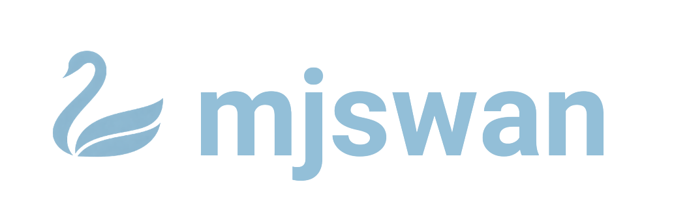

<p align="center">
  
</p>
<p align="center">
  <strong><em>Real-time Interactive AI Robot Simulation in Your Browser</em></strong>
</p>

<p align="center">
  <a href="https://github.com/ttktjmt/mjswan/actions/workflows/deploy.yml"></a>
  <a href="https://github.com/ttktjmt/mjswan/actions/workflows/pytest.yml"></a>
  <a href="https://pypi.org/project/mjswan"></a>
  <a href="https://www.npmjs.com/package/mjswan"></a>
</p>

<p align="center">
  mjswan is a powerful framework for creating interactive MuJoCo simulations with real-time policy control, running entirely in the browser. Built on top of <a href="https://github.com/google-deepmind/mujoco/tree/main/wasm"><strong>MU</strong>joco <strong>WA</strong>sm</a>, <a href="https://github.com/microsoft/onnxruntime">on<strong>NX</strong> runtime</a>, and <a href="https://github.com/mrdoob/three.js/">three.js</a>, it enables easy sharing of AI robot simulation demos as static sites, perfect for GitHub Pages hosting.
</p>

<p align="center">
  <a href="https://ttktjmt.github.io/mjswan/"></a>
</p>

<p align="center">
  <em>Check out the demo ― <a href="https://ttktjmt.github.io/mjswan/">ttktjmt.github.io/mjswan</a></em>
</p>

<p align="center">
  <a href="https://ttktjmt.github.io/mjswan/myosuite"></a>
  &nbsp;
  <a href="https://ttktjmt.github.io/mjswan/menagerie"></a>
  &nbsp;
  <a href="https://ttktjmt.github.io/mjswan/playground"></a>
</p>

---


## Features

- **Real-time**: Run mujoco simulations and policy control in real time.
- **Interactive**: Change the state of objects by applying forces.
- **Cross-platform**: Works seamlessly on desktop and mobile devices.
- **VR Support**: Native VR viewer support with WebXR.
- **Client-only**: All computation runs in the browser. No server for simulation is required.
- **Easy Sharing**: Host as a static site for effortless demo distribution (e.g., GitHub Pages).
- **Customizable**: Visualize your mujoco models and onnx policies quickly.


## Quick Start

mjswan can be installed with `pip`:
``` sh
pip install mjswan  # or 'mjswan[dev]', 'mjswan[examples]'
```

or with `npm`:
``` sh
npm install mjswan
```

You can run the demo using the `uv` command with the python package `mjswan[examples]`:
```sh
uv run full
```

For detailed installation instructions, visit the [documentation](https://mjswan.readthedocs.io).


## Third-Party Assets

mjswan incorporates mujoco models from the external sources in its demo. See the respective submodule for full details, including individual model licenses and copyrights. All models are used under their respective licenses. Please review and comply with those terms for any use or redistribution.

[MyoSuite License](https://github.com/MyoHub/myosuite/blob/main/LICENSE) ･ [MuJoCo Menagerie License](https://github.com/google-deepmind/mujoco_menagerie/blob/main/LICENSE) ･ [MuJoCo Playground License](https://github.com/google-deepmind/mujoco_playground/blob/main/LICENSE)


## Acknowledgments

This project was greatly inspired by the [Facet project demo](https://facet.pages.dev/) from the research group at Tsinghua University.<br>
It is also built upon the excellent work of [zalo/mujoco_wasm](https://github.com/zalo/mujoco_wasm), one of the earliest efforts to run MuJoCo simulations in a browser.


## License

This project is licensed under the [Apache-2.0 License](LICENSE). When using mjswan, please retain attribution notices in the app to help other users discover this project.
