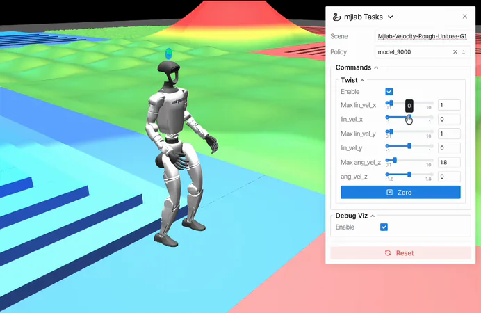

<p align="center">
  
</p>
<p align="center">
  <strong><em>Real-time Interactive RL Simulation in Your Browser</em></strong>
</p>

<p align="center">
  <a href="https://github.com/ttktjmt/mjswan/actions/workflows/deploy.yml"></a>
  <a href="https://github.com/ttktjmt/mjswan/actions/workflows/pytest.yml"></a>
  <a href="https://mjswan.readthedocs.io"></a>
  <a href="https://pypi.org/project/mjswan"></a>
  <a href="https://www.npmjs.com/package/mjswan"></a>
</p>

<p align="center">
  mjswan is a powerful framework for creating interactive MuJoCo simulations with real-time policy control, running entirely in the browser. Built on top of <a href="https://github.com/google-deepmind/mujoco/tree/main/wasm">mujoco wasm</a>, <a href="https://github.com/microsoft/onnxruntime">onnxruntime</a>, and <a href="https://github.com/mrdoob/three.js/">three.js</a>, it enables easy sharing of RL simulation demos as static sites, perfect for GitHub Pages hosting.
</p>

<p align="center">
  <a href="https://ttktjmt.github.io/mjswan/"></a>
</p>

<p align="center">
  <em>Check out the demo ― <a href="https://ttktjmt.github.io/mjswan/">ttktjmt.github.io/mjswan</a></em>
</p>

---


## News

- **2026-08-17**: Created [mjswan_playground](https://github.com/ttktjmt/mjswan_playground), a collection of mjswan demos
- **2026-08-15**: Became mjlab-native, covering most [mjlab](https://github.com/mujocolab/mjlab) tasks
- **2026-06-02**: Adopted for the [MuscleMimic](https://github.com/amathislab/musclemimic) live demo [[Demo](https://mjswan-musclemimic.pages.dev/), [X](https://x.com/ckli85/status/2100242247547572394)]
- **2026-05-06**: Adopted for the [GentleHumanoid](https://gentle-humanoid.axell.top/#/) live demo [[Demo](https://mjswan-gentlehumanoid.pages.dev/), [X](https://x.com/Axell_wppr/status/2051878574874148953)]
- **2026-04-08**: Featured in the [MuJoCo README](https://github.com/google-deepmind/mujoco#first-party-bindings)


## Features

- **Real-time**: Run mujoco simulations and policy control in real time.
- **Interactive**: Change the state of objects by applying forces.
- **Cross-platform**: Works seamlessly on desktop and mobile devices.
- **VR & AR Support**: Native WebXR viewer with tracked hands that interact with objects.
- **Client-only**: All computation runs in the browser. No server for simulation is required.
- **Easy Sharing**: Host as a static site for effortless demo distribution (e.g., GitHub Pages).
- **Portable**: Embed the simulation in a web page or Google Colab notebook.
- **mjlab-native**: Create a web demo of any [mjlab](https://github.com/mujocolab/mjlab) tasks with minimal effort.
- **Customizable**: Visualize your mujoco models and onnx policies quickly.


## Quick Start

mjswan can be installed with `pip`:
``` sh
pip install mjswan  # or 'mjswan[dev]', 'mjswan[examples]'
```

or with `npm`:
``` sh
npm install mjswan
```

The demos live in `examples/`, which the wheel does not ship, so run them with the
`mjswan` CLI from a clone of this repository (after `pip install -e '.[examples]'`):
``` sh
mjswan demo          # lists the bundled demos
mjswan demo simple   # runs the simple demo
```

The minimum python script for a sanity check:
``` python
import os, mujoco, mjswan

model_path = os.path.join(os.path.dirname(mujoco.__file__), "testdata", "model.xml")
mjspec = mujoco.MjSpec.from_file(model_path)

builder = mjswan.Builder()
builder.add_project(name="Sanity Check").add_scene(name="Test Model", spec=mjspec)
app = builder.build()
app.launch()
```

For detailed instructions, visit the [documentation](https://mjswan.readthedocs.io).


## Acknowledgments

This project was greatly inspired by the [Facet project demo](https://facet.pages.dev/) from the research group at Tsinghua University.<br>
It is also built upon the excellent work of [zalo/mujoco_wasm](https://github.com/zalo/mujoco_wasm), one of the earliest efforts to run MuJoCo simulations in a browser.


## License

This project is licensed under the [Apache-2.0 License](LICENSE). When using mjswan, please retain attribution notices in the app to help other users discover this project.
