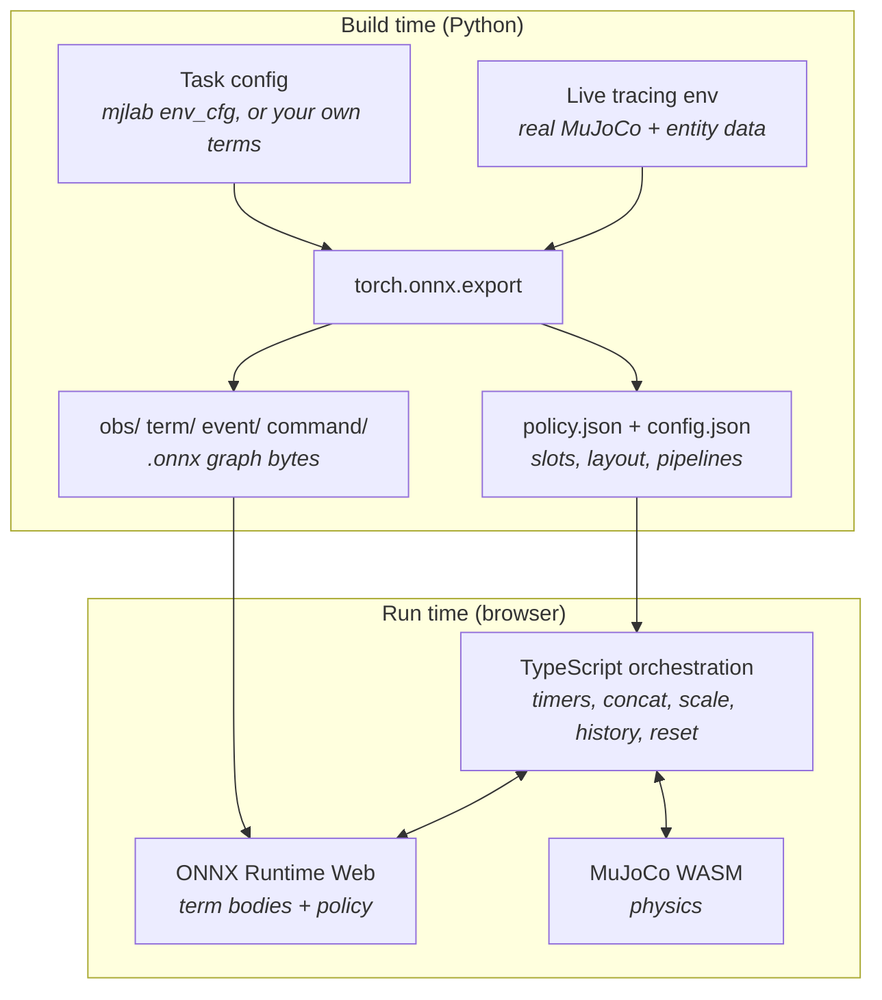

# How the Build Works

A mjswan app has no server. Everything the browser needs — the model, the policy
network, and the MDP logic that surrounds it — is compiled into static files at build
time. This page explains what `builder.build()` produces and why, so that error messages
and artifact layouts read as intentional rather than mysterious.

If you only want to ship a viewer, you can skip this page. Read it when you are writing
your own observation or termination terms, debugging a build failure, or wondering how a
policy trained in [mjlab](mjlab.md) ends up behaving the same way in a browser tab.

## The problem

A trained policy is only half of an environment. The other half is the *MDP layer*: the
observations fed into the network, the action term that turns its output into actuator
commands, the termination conditions that end an episode, the events that randomize a
reset, and the commands a user steers with. In mjlab those are Python functions over
PyTorch tensors. In a browser there is no Python and no PyTorch.

mjswan's answer is to **trace those functions to ONNX at build time** and run them with
ONNX Runtime Web — the same runtime that already runs the policy network.

!!! info "Design record"
    The reasoning behind this, including the alternatives that were rejected, is
    [ADR 0005](https://github.com/ttktjmt/mjswan/blob/main/docs/adr/0005-onnx-traced-terms-superseding-the-declarative-dsl.md){:target="_blank"}.
    Earlier versions of mjswan interpreted a hand-written JSON DSL in TypeScript
    instead; that required a second implementation of every mjlab operation, kept
    numerically in lockstep by hand.

## What that buys you

**You pass mjlab's own functions.** There is no mjswan reimplementation of
`base_ang_vel` or `bad_orientation` to import, and no lookup table mapping mjlab names
onto browser classes. The function object in your config *is* what gets traced:

```python
from mjlab.envs.mdp import observations as obs_fns
from mjswan.managers.observation_manager import ObservationGroupCfg, ObservationTermCfg

ObservationGroupCfg(
    terms={
        "base_ang_vel": ObservationTermCfg(func=obs_fns.base_ang_vel),
        "joint_pos": ObservationTermCfg(func=obs_fns.joint_pos_rel, scale=1.0),
    }
)
```

A term you write yourself is treated identically — same signature, same treatment, no
registration step.

**Nothing is silently dropped.** A term the tracer cannot express fails the build and
names itself. That matters more than it sounds: a missing observation silently shortens
the vector the policy was trained on, and a missing termination leaves the browser
without a reset condition the task is configured to have. Both would look like a working
build.

**Numbers are verified, not assumed.** A parity harness steps the real mjlab environment
and feeds the same states through the exported graphs, asserting every term's output
matches every step. Across the seven reference mjlab tasks (73 terms) the worst
disagreement is ~9e-08 — float32 rounding.

## The pipeline



### Term body vs. orchestration

The split is strict, and it is the key to understanding the artifacts:

| Manager | Term body (the math you wrote) | Orchestration (mjswan's TypeScript) |
|---|---|---|
| Observation | **ONNX**, fused into one graph per group | concatenate, clip, scale, history |
| Termination | **ONNX**, one bool lane per term | OR-reduce, terminated-vs-truncated split |
| Action | **none** — native | the full term (`raw * scale + offset`, clip, PD, actuator write) |
| Event | **ONNX**, run only when the trigger fires | interval countdown, startup-once, reset gating |
| Command | **ONNX**, state threaded explicitly | resample timer, held state, UI override |

Action is deliberately native: it is a closed set of term types, it is the hottest loop
(once per physics substep, not once per control step), and it must be synchronous.

Only these five managers exist. Reward, curriculum, metrics, and recorders are training
concerns and mjswan is a playback tool, so a task's reward config is simply ignored — it
is never emitted into the bundle.

### Fusion

Terms in a group are traced into **one** graph rather than one graph per term. The
motivation is per-call overhead, not arithmetic: a JS→WASM crossing, tensor marshalling
and a promise round-trip cost the same whether the graph has one node or a hundred.

A real measurement, Velocity-Flat-G1: five observation terms compiled to five graphs of
**one node each** — three of them a bare `Identity`, because the term body was
`sensor.data`. At 50 Hz that is 250 ONNX Runtime calls per second whose entire arithmetic,
per step, is 58 float subtractions and 9 copied floats. Fused, it is one 59-node graph and
one call per control step. Fusion also removes duplicated slot work, since a slot feeding
two terms was read, converted to float32, and marshalled twice.

The governing rule is worth stating explicitly, because it is easy to misread:

> **Fusion changes how many graphs exist, never how often they are called.**

An event that fires once per episode still runs once per episode, fused or not. That is why
event fusion was measured and declined — across the reference tasks, `startup` has no traced
terms at all and `reset` has at most two.

Two group shapes deliberately do **not** fuse, and fall back to per-term graphs:

- a group holding a legacy custom-TypeScript term, whose body only exists in the browser;
- a group whose terms carry their own `history_length` / `history_steps`, because mjlab
  stacks history per term *before* concatenating, and a ring buffer over a fused vector
  would give step-major order where mjlab gives term-major.

### Input slots

A graph needs the simulation state it reads. The build records that as **slots** in
`policy.json`, and the browser's slot reader serves each one from `mjModel` / `mjData`:

```json
"input_slots": [
  { "entity": "robot", "field": "joint_pos", "input": "robot__joint_pos", "shape": [1, 29] },
  { "entity": "robot", "field": "projected_gravity_b", "input": "robot__projected_gravity_b", "shape": [1, 3] }
]
```

Four slot namespaces exist: an entity `data` field (as above), a named MuJoCo sensor's
`sensordata` window, a live command's state field, and a raw `mjData` field
(`{"sim": "act"}`) for the few things mjlab's `EntityData` does not wrap — a muscle
model's activation state, or the sim time — which a term reads off
`entity.data.data.<field>`. Anything model-derived and therefore constant is baked into
the graph instead of becoming a slot.

A handful of values have no simulation slot at all — the previous action, a command's
current value, a baked constant — so they arrive as **native inputs** the orchestrator
fills in:

```json
"native_inputs": [
  { "name": "last_action", "native": "prev_action", "input": "native__last_action", "size": 29 },
  { "name": "velocity_cmd", "native": "command", "input": "native__velocity_cmd", "command_name": "velocity", "size": 3 }
]
```

### Randomness and state

Term bodies never draw their own random numbers. All randomness comes from a single
seeded PRNG in the TypeScript orchestrator and is passed into the graph as an explicit
`rand` input tensor; the graph's `rand_dim` declares how many values it consumes. The
seed is reachable from the engine API (`termSeed`) and reported back in its state
snapshot, so an app can persist the seed it ran with.

Stateful terms — a velocity command holding a heading target, say — are exported the way
an RNN cell is: hidden state promoted to explicit input and output, with the orchestrator
holding it across frames. A reset is not a separate code path; it is the same graph
called with `resample_mask = 1`.

!!! note "Replay is approximate, not bit-for-bit"
    Traced term calls are asynchronous, and the runtime skips a call that is still
    in flight rather than blocking the frame. A skipped frame consumes one fewer draw,
    so later draws shift — and a termination verdict arriving a frame late moves the
    reset frame, which is control flow rather than randomness. Startup randomization is
    drawn synchronously and *is* fully reproducible; a command's resample schedule is
    drawn before the in-flight check and is timing-independent too.

## Artifact layout

For an mjlab velocity task with eleven checkpoints, one traced command, two reset events
and one traced termination:

```
dist/main/assets/mjlab_velocity_flat_unitree_g1/
├── scene.mjz              # the MuJoCo model
├── model_2000.onnx        # the trained policy network (one per checkpoint)
├── model_2000.json        # its policy config: slots, layout, actions, commands
├── obs/policy.onnx        # fused observation group
├── term/fell_over.onnx    # traced termination body
├── command/twist.onnx     # traced command body (stateful)
└── event/
    ├── reset_base.onnx
    └── reset_robot_joints.onnx
```

`obs/`, `term/` and `command/` are referenced from `policy.json`; `event/` is referenced
from `config.json`, because events are scene-scoped and survive a policy switch.

Some randomization needs no graph at all. Startup domain randomization that perturbs
`mjModel` rather than `mjData` — geom friction, body COM offsets — is emitted as a
**descriptor** (field, entity names, axis ranges, operation, distribution) that the
browser applies once at load from the seeded PRNG. Entity *names* rather than ids,
because the browser compiles its own model.

## What can fail, and what to do about it

### A term cannot be traced

The build fails and names the term. Two ways out, both via
[`register_observation`](../api/core.md#mdp-extension-registries) and its siblings:

1. **A trace-friendly replacement callable** — same signature, rewritten so
   `torch.onnx.export` can follow it. Reach for this when the task's own function is
   correct but not exportable *as written* (tensor-method RNG, data-dependent control
   flow). This is the usual answer.
2. **A `*Binding` with `ts_src`** — for logic ONNX cannot express at all. `ts_src` is the
   absolute path of a `.ts` file exporting the class named by `ts_name`; the builder
   injects it into the browser bundle. A binding *without* `ts_src` also fails the build:
   mjswan ships no built-in TypeScript term classes, so there is nothing to fall back on.

In practice tracing failures are rare, because mjlab must run thousands of parallel
environments on a GPU. That forces term bodies to avoid per-environment Python
`if`/`for` over tensor values in favour of masking — which is exactly the shape
`torch.onnx.export` needs.

### A scene has no tracing environment

Tracing needs a live environment to read shapes and resolve `SceneEntityCfg` patterns
into static indices. An [mjlab scene](mjlab.md) builds one from its task automatically. A
plain `add_scene()` scene has none, so a policy with traced terms on it raises — supply
one explicitly:

```python
from mjswan.trace_env import build_single_entity_trace_env

scene = project.add_scene(name="Hovering Box", spec=build_spec(), control_dt=0.02)
scene.set_trace_env(build_single_entity_trace_env(build_spec))
```

`build_single_entity_trace_env` builds a minimal environment out of mjlab's own `Entity`
and `Scene` from a single model spec. It configures no managers and is never stepped — it
is only the tracer's read/write target.

!!! warning "`mjlab` and `torch` are build-time dependencies for traced terms"
    Tracing runs `torch.onnx.export` against a live mjlab environment, so a policy with
    observation or termination terms needs both installed at build time (`pip install
    'mjswan[examples]'`). Neither ships to the browser, and a *model-only* scene needs
    neither. See [Installation](../getting-started/installation.md).

### A scene with a policy has no `control_dt`

The MuJoCo model carries only the physics timestep. The rate the *policy* acts at —
mjlab's `timestep * decimation` — is not in the model, and nothing else can supply it. A
wrong control rate raises no error at playback; it just runs the policy at a speed it was
never trained for. So the build requires it:

```python
project.add_scene(name="Robot", spec=spec, control_dt=0.02)  # 50 Hz
```

`add_scene_mjlab` fills it in from the task.

## Next steps

- [MDP Terms](policy-config.md) — the practical reference for the term kwargs
- [Using mjlab](mjlab.md) — visualize a trained mjlab task
- [Python API](../api/core.md) — every public symbol
