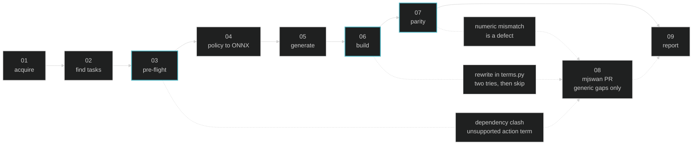

# mjlab-to-mjswan

An agent skill that ports any mjlab task into a browser app built by [mjswan](https://github.com/ttktjmt/mjswan). The target could be a local path or a GitHub URL.

A local path is used as is; a GitHub URL is cloned into the working directory. Either way the skill generates `mjswan_app/` inside the target repo.

## Usage

E.g., **Claude Code**

```
/plugin marketplace add ttktjmt/mjswan
/plugin install mjswan@ttktjmt
```

Then invoke it with the target repo:

```
/mjswan:mjlab-to-mjswan https://github.com/mujocolab/g1_spinkick_example
```

Any other agent can follow `SKILL.md` directly, it is plain Markdown with no vendor-specific syntax.

Either way the agent needs `git` and a Python 3.10-3.12 environment in which the target repo's task registrations import; it installs `mjswan[mjlab]` and `onnxruntime` into that environment itself, plus the `wandb` or `hf` extra when the checkpoints come from there.

## The pipeline

Nine stages, three of them gates. `03` costs seconds and answers "not portable" before anything expensive runs; `06` and `07` cost minutes. `08` runs only when what a gate blocked on is mjswan's own gap rather than the task's.



## What parity proves, and what it does not

A successful build only proves every term *traced*. `run_parity`, the harness mjswan's own CI runs, catches a term that traced but computes the wrong numbers.

The same raw state goes to both sides and the outputs are compared, so what is proven is that the graph reproduces mjlab's term, nothing more. How a policy trained under `mujoco_warp` behaves under the browser's WASM integration lies outside that line, and the skill says so in its report.

## What gets generated

```
mjswan_app/
  main.py           builder wiring; the only entry point
  terms.py          upstream MDP terms re-implemented traceably (only what the build needs)
  export_policy.py  .pt to ONNX converter   (local checkpoints only)
  model_*.onnx      converted checkpoints
  policy_meta.json  checkpoint order + metadata
  README.md         source URL, prerequisites, run command
  dist/             the build: engine + simulation document (written by main.py)
```

`terms.py` is the single place an MDP term is rewritten: a term that `torch.onnx.export` will not trace gets a traceable re-implementation and its `register_*` call there, observation, termination, event or command alike. Only the terms that actually failed, because each one is a second copy of upstream math, and step `07` is what holds those copies to the original.

Run it from the repo root with `python -m mjswan_app.main`. `mjswan info mjswan_app/dist` reads back what the build wrote — projects, scenes, MDPs, policies — and `app.save_document()` packs the document alone as `dist.swn`, one file that `mjswan serve`, `mjswan info` and `mjswan publish` all accept.

## What it will not write

- **TypeScript (`ts_src`)**: a `uses_custom_js` build cannot be published to mjswan Cloud.
- **`ViewerConfig`**: a camera cannot be judged without looking at it, so the default stands.
- **mjswan itself**, with one exception: a missing capability other tasks would need too becomes a pull request against mjswan. A gap only this task has never does.
